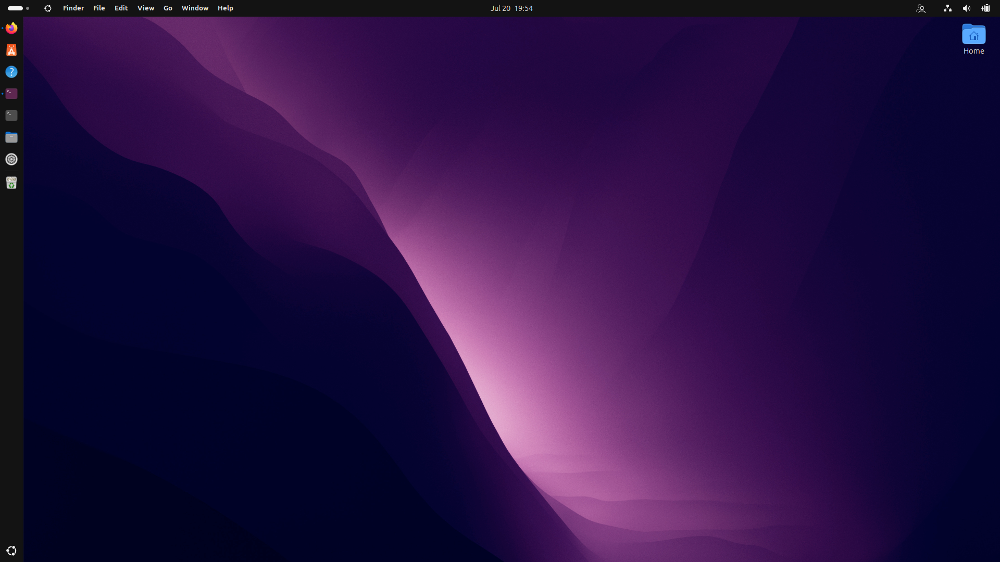

# AppMenu

<div align="center">

**A zero-dependency macOS-style global menu bar for GNOME Shell**

[](https://www.gnome.org/)
[](LICENSE)
[](https://github.com/ChathurangaBW/AppMenu/releases)

</div>

<p align="center">
  
</p>

AppMenu brings a macOS-style menu bar to the GNOME top panel without external daemons or background services. It provides app-aware menus, optional real exported app menus when available, keyboard shortcuts, recent items, workspace controls, search, and fast user switching in one lightweight GNOME Shell extension.

## Why AppMenu

- **No external daemon**: pure GJS extension, no Python service or appmenu daemon
- **No manual GTK module setup**: no `~/.gtkrc-2.0`, no hand-written startup helper, no extra daemon to babysit
- **Works across app toolkits**: GTK, Qt, Electron, Flatpak, browsers, terminals, and Java apps all get the same menu actions
- **Wayland-friendly**: uses GNOME Shell APIs and virtual keyboard events instead of X11-only menu scraping
- **Hybrid behavior**: reads real exported menus when apps provide them, and falls back automatically when they do not

## Highlights

- Apple menu with system actions, recent items, and Search
- Dynamic app menu based on the focused window
- Optional real D-Bus app menu import for supported apps
- File, Edit, View, Go, Window, and Help menus
- Workspace navigation and window-to-workspace actions
- Optional macOS-style workspace dots in the panel
- Spotlight-style search dialog for apps, recent files, and settings
- Fast user switching with avatars and session badges
- Configurable distro icon or Apple logo
- Debug logging toggle for troubleshooting
- GNOME Shell 45 to 50 support

## Features

### Apple Menu

- About This Computer
- System Settings
- App Store
- Recent Items
- Search
- Force Quit
- Sleep, Restart, Shut Down
- Lock Screen, Log Out

### Global Menu Bar

| Menu | What it includes |
|---|---|
| **App** | About, New Window, App Details, Quit, open windows list |
| **File** | New Folder, New Tab, Open, Open With, Print, Get Info, Rename, Find, Trash, Eject |
| **Edit** | Undo, Redo, Cut, Copy, Paste, Delete, Select All, Emoji & Symbols |
| **View** | Icon/List view, sorting, reverse sort, path bar, hidden files, full screen |
| **Go** | Back, Forward, Recents, Documents, Desktop, Downloads, Home, Computer, Network |
| **Window** | Minimize, Maximize, Tile, workspace switching, move window between workspaces, close |
| **Help** | Feedback and GNOME Help |

### Spotlight-Style Search

Open AppMenu Search from the Apple menu or with `Ctrl+Space`.

Search sources:

- Installed applications
- Recent files
- GNOME Settings panels

### Workspace Controls

The Window menu includes:

- Previous Workspace
- Next Workspace
- Move Window Left
- Move Window Right

Enable **Show Workspace Indicator** in preferences to show macOS-style workspace dots in the panel.

## AppMenu vs Other GNOME Menu Extensions

| Feature | AppMenu | Fildem | global-menu-for-gnome | Kiwi Menu |
|---|---:|---:|---:|---:|
| Pure GNOME Shell extension | Yes | No | Yes | Yes |
| External daemon required | No | Yes | No | No |
| GTK module setup required | No | Yes | No | No |
| Works with GTK/Qt/Electron/Flatpak apps | Yes | Partial | Partial | N/A |
| Recent items | Yes | No | No | Yes |
| Fast user switching | Yes | No | No | No |
| Workspace indicator/actions | Yes | No | No | No |
| Spotlight-style search | Yes | HUD only | No | No |
| One-shot installers | Yes | Yes | No | No |

AppMenu now uses a **hybrid approach**:

- for apps that export Canonical dbusmenu data, AppMenu can read and trigger the real menu items
- for modern GTK and libadwaita apps that expose `org.gtk.Actions`, AppMenu can build native action-backed menus without synthetic key presses
- for apps that expose neither path, AppMenu falls back to stable cross-app actions and shortcuts

This keeps the extension useful on GTK4, Qt, Electron, Java, Flatpak, and Wayland, where full exported menu trees are often partial or absent.

## Installation

### From GNOME Extensions

Use the dedicated upload package when submitting to extensions.gnome.org:

- `AppMenu-e.g.o-upload-v4.zip`

This ZIP has `metadata.json` and `extension.js` at the archive root, which is required by the GNOME Extensions upload validator.

### Release Packages

Download from the [latest release](https://github.com/ChathurangaBW/AppMenu/releases):

- `AppMenu-e.g.o-upload-v4.zip`: upload package for extensions.gnome.org
- `appmenu@ChathurangaBW.github.io.zip`: manual GNOME Shell extension package
- `AppMenu-v4-linux.run`: one-shot self-extracting installer
- `AppMenu-v4-linux.bin`: one-shot self-extracting installer alias
- `appmenu_4_all.deb`: Debian and Ubuntu package
- `AppMenu-v4.zip`: source snapshot

### From Source

```bash
git clone https://github.com/ChathurangaBW/AppMenu.git
cd AppMenu
bash install.sh
```

Then restart GNOME Shell:

- **Wayland:** log out and log back in
- **X11:** press `Alt+F2`, type `r`, then press Enter

## Configuration

Open preferences with:

```bash
gnome-extensions prefs appmenu@ChathurangaBW.github.io
```

Available settings:

| Setting | Description |
|---|---|
| **Show OS icon** | Toggle the logo near the Apple menu |
| **Icon** | Select a distro icon or Apple logo |
| **Lock to focused app** | Keep panel app label tied to the focused app |
| **Use real application menus** | Use dbusmenu or native GTK action exports when supported, with automatic fallback |
| **Show User Switcher** | Show avatar-based fast user switching |
| **Show Workspace Indicator** | Show macOS-style workspace dots |
| **Debug Logging** | Enable diagnostic GNOME Shell journal logs |

## Development

Build release packages:

```bash
./scripts/build-packages.sh
```

Generated files go to `dist/`.

## Project Structure

```text
AppMenu/
├── extension.js                 # Extension lifecycle
├── menuManager.js               # Panel menu orchestration
├── searchDialog.js              # Spotlight-style search dialog
├── workspaceIndicator.js        # Workspace dots controller
├── userSwitcher.js              # Fast user switching UI
├── recentItemsSubmenu.js        # Recent items submenu
├── documentTooltip.js           # Recent item tooltip support
├── logger.js                    # Debug-gated logging
├── prefs.js                     # Preferences window
├── stylesheet.css               # Shell styling
├── schemas/                     # GSettings schema
├── actions/                     # Action handlers
├── menus/                       # Menu definitions
├── icons/                       # SVG icons
├── scripts/build-packages.sh    # Release package builder
├── install.sh
└── uninstall.sh
```

## License

GPL-3.0-or-later © ChathurangaBW

<div align="center">
  <sub>Built for GNOME. Inspired by macOS.</sub>
</div>
