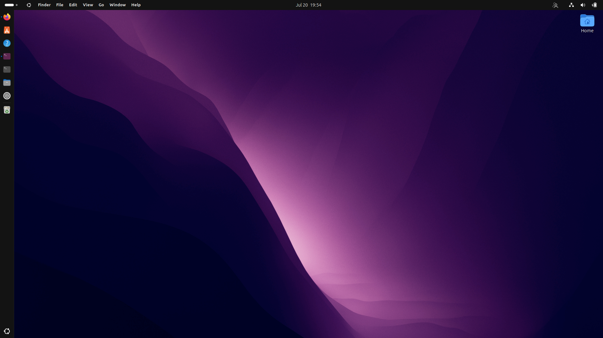

# AppMenu

<div align="center">

**A zero-dependency macOS-style global menu bar for GNOME Shell**

[](https://www.gnome.org/)
[](LICENSE)
[](https://github.com/ChathurangaBW/AppMenu/releases)

</div>

> **Note:** AppMenu is commonly referred to as the **global menu** for GNOME Shell. It is a macOS-style **global menu bar** (one menu bar across the top panel that reflects the focused app) plus an Apple menu, Spotlight-style search, user switching, workspace controls, and a system menu — all in a single zero-dependency extension. If you searched for "global menu GNOME", "macOS menu bar", "HUD menu", or "AppMenu", this is the same project.

> **Important for Fedora and system-install users:** If GNOME Shell reports `Unable to load .../i18n.js` from `/usr/local/share` or `/usr/share`, a stale system-wide copy from an older AppMenu version is still present and shadowing your updated install. Run `bash install.sh --clean-stale` to remove it automatically, or see the [troubleshooting section](#i18njs-missing-from-usrlocalshare) below for manual cleanup.

<p align="center">
  
</p>

AppMenu brings a macOS-style **global menu bar** to the GNOME top panel without external daemons or background services. It provides app-aware menus, optional real exported app menus when available, keyboard shortcuts, recent items, workspace controls, search, and fast user switching in one lightweight GNOME Shell extension.

## Why AppMenu

- **No external daemon**: pure GJS extension, no Python service or appmenu daemon
- **No manual GTK module setup**: no `~/.gtkrc-2.0`, no hand-written startup helper, no extra daemon to babysit
- **Works across app toolkits**: GTK, Qt, Electron, Flatpak, browsers, terminals, and Java apps all get the same menu actions
- **Wayland-friendly**: uses GNOME Shell APIs and virtual keyboard events instead of X11-only menu scraping
- **Hybrid behavior**: reads real exported menus when apps provide them, and falls back automatically when they do not

## Global Menu Reference

AppMenu is the **global menu** for GNOME Shell. The "global menu" pattern means all of an app's menus live in a single bar at the top of the screen rather than inside each app window. This is what macOS calls the menu bar and what GTK calls the global menubar.

| Project | What it does | How AppMenu relates |
|---|---|---|
| **AppMenu** (this repo) | One global menu bar across all of GNOME Shell, plus Apple menu, search, user switching, workspace indicator, and a system menu | The modern, zero-dependency global menu for GNOME 45–50 |
| global-menu-for-gnome | Generic global menu bar with a system menu | AppMenu is a superset (everything it has, plus real menus, search, user switcher, workspace indicator, i18n) |
| Fildem | Qt/GTK HUD with dbusmenu backend | AppMenu achieves the same coverage without the Python appmenu daemon |
| Kiwi Menu | macOS-style menu bar | AppMenu ships that menu bar plus more utilities |
| Ubuntu's appmenu-gtk-module | Legacy X11 xtmod | AppMenu does not rely on it |

## Highlights

- Apple menu with system actions, recent items, and Search
- AppMenu Status submenu with copyable troubleshooting information
- Dynamic app menu (global menu) based on the focused window
- Optional real D-Bus app menu import for supported apps
- File, Edit, View, Go, Window, and Help menus
- System menu in the panel: Terminal, Software Center, System Monitor, Extensions, App Grid, Force Quit, Sleep, Restart, Shut Down, Lock Screen, Log Out
- Workspace navigation and window-to-workspace actions
- Optional workspace navigation dots in the panel
- Spotlight-style search dialog for apps, recent files, and settings
- Fast user switching with avatars and session badges
- Configurable distro icon or Apple logo
- Custom user-defined menu items (commands or keyboard shortcuts)
- Debug logging toggle for troubleshooting
- GNOME Shell 45 to 50 support

## Features

### Apple Menu

- About This Computer
- AppMenu Status with current app, menu source, and copyable troubleshooting info
- System Settings
- App Store
- Recent Items
- Search
- Force Quit
- Sleep, Restart, Shut Down
- Lock Screen, Log Out

### Global Menu Bar

| Menu | What it includes |
|---|---|
| **App** | About, New Window, App Details, Quit, open windows list |
| **File** | New Folder, New Tab, Open, Open With, Print, Get Info, Rename, Find, Trash, Eject |
| **Edit** | Undo, Redo, Cut, Copy, Paste, Delete, Select All, Emoji & Symbols |
| **View** | Icon/List view, sorting, reverse sort, path bar, hidden files, full screen |
| **Go** | Back, Forward, Recents, Documents, Desktop, Downloads, Home, Computer, Network |
| **Window** | Minimize, Maximize, Tile, workspace switching, move window between workspaces, close |
| **Help** | Feedback and GNOME Help |

### Spotlight-Style Search

Open AppMenu Search from the Apple menu or with `Ctrl+Space`.

Search sources:

- Installed applications
- Recent files
- GNOME Settings panels

Results are grouped by type and show icons so users can tell apps, recent files, and settings apart quickly.

### Workspace Controls

The Window menu includes:

- Previous Workspace
- Next Workspace
- Move Window Left
- Move Window Right

Enable **Show Workspace Indicator** in preferences to show workspace navigation dots in the panel. Use **Workspace Indicator Position** to place the dots on the left or right side of the top panel.

## AppMenu vs Other GNOME Menu Extensions

AppMenu, global-menu-for-gnome, Fildem, and Kiwi Menu are all "global menu" extensions for GNOME Shell. They all deliver a single menu bar at the top of the screen instead of per-window menus. AppMenu is the modern, zero-dependency, full-featured option.

| Feature | AppMenu | Fildem | global-menu-for-gnome | Kiwi Menu |
|---|---:|---:|---:|---:|
| Pure GNOME Shell extension (no external daemon) | Yes | No | Yes | Yes |
| Global menu bar across all of GNOME | Yes | Yes | Yes | Yes |
| External daemon required | No | Yes | No | No |
| GTK module setup required | No | Yes | No | No |
| Works with GTK/Qt/Electron/Flatpak apps | Yes | Partial | Partial | N/A |
| Real exported app menus (dbusmenu, org.gtk.Actions) | Yes | Yes | No | No |
| Synthetic-action fallback when no exported menu | Yes | No | No | No |
| Window list per app | Yes | No | No | No |
| Quit App, App Details | Yes | No | No | No |
| Force Quit | Yes | No | Yes | No |
| Recent items | Yes | No | No | Yes |
| Fast user switching | Yes | No | No | No |
| Workspace indicator/actions | Yes | No | No | No |
| Spotlight-style search | Yes | HUD only | No | No |
| System menu (Terminal, Software Center, Power) | Yes | No | Yes | No |
| Custom user-defined menus | Yes | No | Yes | No |
| i18n / translations | Yes | No | No | No |
| One-shot installers (.run, .bin, .deb) | Yes | Yes | No | No |
| Stale-copy detection (`--clean-stale`) | Yes | No | No | No |
| GNOME Shell 45 to 50 support | Yes | Yes | Yes | Yes |

AppMenu now uses a **hybrid approach**:

- for apps that export Canonical dbusmenu data, AppMenu can read and trigger the real menu items
- for modern GTK and libadwaita apps that expose `org.gtk.Actions`, AppMenu can build native action-backed menus without synthetic key presses
- for apps that expose neither path, AppMenu falls back to stable cross-app actions and shortcuts

This keeps the extension useful on GTK4, Qt, Electron, Java, Flatpak, and Wayland, where full exported menu trees are often partial or absent.

## Installation

### From GNOME Extensions

Use the dedicated upload package when submitting to extensions.gnome.org:

- `AppMenu-e.g.o-upload-v5.4.zip`

This ZIP has `metadata.json` and `extension.js` at the archive root, which is required by the GNOME Extensions upload validator.

### Release Packages

Download from the [latest release](https://github.com/ChathurangaBW/AppMenu/releases):

- `AppMenu-e.g.o-upload-v5.4.zip`: upload package for extensions.gnome.org
- `appmenu@ChathurangaBW.github.io.zip`: manual GNOME Shell extension package
- `AppMenu-v5.4-linux.run`: one-shot self-extracting installer
- `AppMenu-v5.4-linux.bin`: one-shot self-extracting installer alias
- `appmenu_5.3.2_all.deb`: Debian and Ubuntu package
- `AppMenu-v5.4.zip`: source snapshot

### From Source

```bash
git clone https://github.com/ChathurangaBW/AppMenu.git
cd AppMenu
bash install.sh
```

For a system-wide install, such as `/usr/local/share/gnome-shell/extensions`, run:

```bash
sudo bash install.sh --system --prefix=/usr/local
```

To replace a system package location, use `--prefix=/usr` instead.

Then restart GNOME Shell:

- **Wayland:** log out and log back in
- **X11:** press `Alt+F2`, type `r`, then press Enter

## Configuration

Open preferences with:

```bash
gnome-extensions prefs appmenu@ChathurangaBW.github.io
```

Available settings:

| Setting | Description |
|---|---|
| **Show OS icon** | Toggle the logo near the Apple menu |
| **Icon** | Select a distro icon or Apple logo |
| **Lock to focused app** | Keep panel app label tied to the focused app |
| **Use real application menus** | Use dbusmenu or native GTK action exports when supported, with automatic fallback |
| **Show User Switcher** | Show avatar-based fast user switching |
| **Show Workspace Indicator** | Show workspace navigation dots |
| **Workspace Indicator Position** | Choose left or right panel placement for workspace dots |
| **Debug Logging** | Enable diagnostic GNOME Shell journal logs |
| **Reset AppMenu Settings** | Restore AppMenu preferences to packaged defaults |

Preferences are grouped into Appearance, Menu Behavior, Panel Extras, and Diagnostics sections.

## Troubleshooting

### AppMenu appears to do nothing

1. Open the Apple menu in the top panel.
2. Open **AppMenu Status**.
3. Choose **Copy Troubleshooting Info**.
4. Paste that information into the GitHub issue, along with your GNOME version and whether you are on Wayland or X11.

The status submenu reports the focused app, app ID, window class, real-menu setting, menu source, debug logging state, user switcher state, and workspace indicator state.

### Real menus vs fallback menus

AppMenu tries real exported menus first when **Use real application menus** is enabled. Some modern apps, sandboxed apps, or Wayland sessions do not expose full menu trees. In those cases AppMenu falls back to stable cross-app actions so the menu bar remains useful instead of disappearing.

### After installing or upgrading

GNOME Shell can keep old extension modules cached in the current Wayland session. If AppMenu still behaves like an older version after installing or upgrading:

- **Wayland:** log out and log back in.
- **X11:** press `Alt+F2`, type `r`, then press Enter.

This is a GNOME Shell session cache behavior. The installed files can be correct while the already-running shell still has old module code loaded.

### `i18n.js` missing from `/usr/local/share`

If GNOME Shell reports an error like `Unable to load file ... /usr/local/share/gnome-shell/extensions/appmenu@ChathurangaBW.github.io/i18n.js`, a stale system-wide install is shadowing the updated user install. The old copy does not have `i18n.js`, and GNOME Shell loads it instead of the new one.

**Automatic fix (recommended):**

```bash
bash install.sh --clean-stale
```

This removes stale copies in other extension folders before installing. Then log out and back in.

**Manual fix:**

```bash
sudo rm -rf /usr/local/share/gnome-shell/extensions/appmenu@ChathurangaBW.github.io
sudo rm -rf /usr/share/gnome-shell/extensions/appmenu@ChathurangaBW.github.io
bash install.sh
```

If you intentionally want a system-wide install, use:

```bash
sudo bash install.sh --system --prefix=/usr/local
test -f /usr/local/share/gnome-shell/extensions/appmenu@ChathurangaBW.github.io/i18n.js
```

### Collecting logs

Enable **Debug Logging** in preferences only while troubleshooting. Then collect logs with:

```bash
journalctl --user -b | grep -i AppMenu
```

Disable debug logging again after collecting the information.

## Development

Build release packages:

```bash
./scripts/build-packages.sh
```

Generated files go to `dist/`.

## Project Structure

```text
AppMenu/
├── extension.js                 # Extension lifecycle
├── menuManager.js               # Panel menu orchestration
├── searchDialog.js              # Spotlight-style search dialog
├── workspaceIndicator.js        # Workspace dots controller
├── userSwitcher.js              # Fast user switching UI
├── recentItemsSubmenu.js        # Recent items submenu
├── documentTooltip.js           # Recent item tooltip support
├── logger.js                    # Debug-gated logging
├── prefs.js                     # Preferences window
├── stylesheet.css               # Shell styling
├── schemas/                     # GSettings schema
├── actions/                     # Action handlers
├── menus/                       # Menu definitions
├── icons/                       # SVG icons
├── scripts/build-packages.sh    # Release package builder
├── install.sh
└── uninstall.sh
```

## License

GPL-3.0-or-later © ChathurangaBW

<div align="center">
  <sub>Built for GNOME. Inspired by macOS.</sub>
</div>
